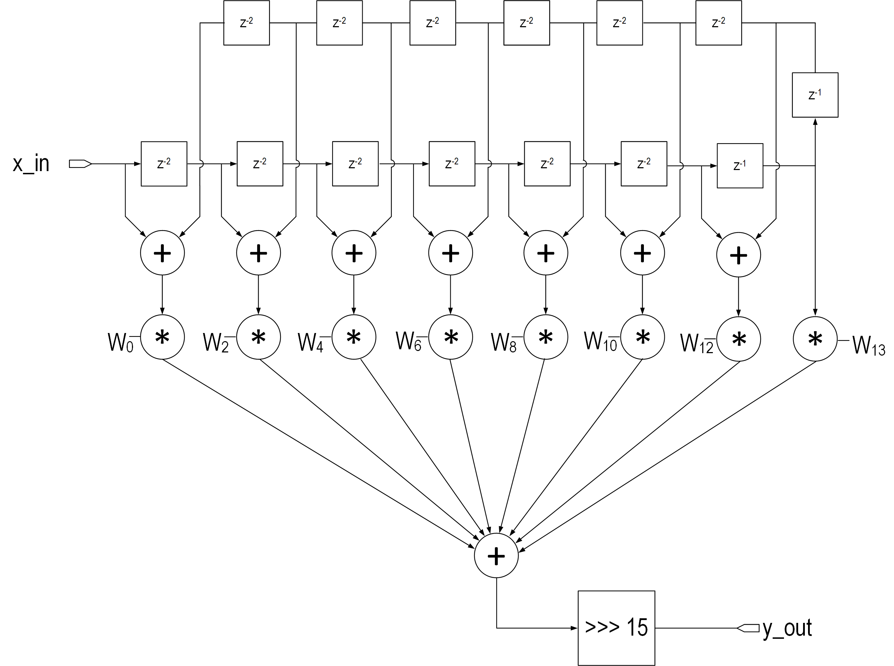

# half-band-filter
An implementation of a half-band filter, from MATLAB to fixed point in SystemVerilog.  It annoyed me there was not much fixed point FIR filter code, showing how to take a Matlab model and generate RTL. 

## Contents

* `readme.md` you're reading this
* ./matlab/ - Directory containing Matlab functions to design the half-band filter, check the implementation in fixed point, and create test vectors for RTL vector matching
* ./rtl/ - Directory containing SystemVerilog RTL code consisting of a synthesizable module and a test bench using the test vectors created with Matlab.
* ./images/ - images for this repo

## Half-Band Filters

We can see from the impulse response that this is an odd-length Symmetric FIR filter which approximates a windowed discrete Sinc function, and every 2nd tap except for the middle tap has a value of 0, and the taps have symmetry about the center tap.  This allows the filter to be implemented in an efficient manner:

only 8 multiplies are required to implement this 27-tap filter.

### Matlab Implementation

### fi, and the problem with fi

In RTL (Register Transfer Level) designs, fixed-point filters are commonly implemented using different formats, with Q Format being the most prevalent. However, there are other formats used in the industry as well. While the MATLAB fi functions are valuable for checking overflow and optimizing bit-widths, the actual filter implementation typically employs the Q format. This creates a discrepancy between MATLAB and the implemented designFortunately, converting from the Matlab floating point to Q format is very straightforward, as you can see below.

### Q Format and Q Conversion to/from float:
For this code, Q15 is used and consists of a sign bit plus 15 fractional bits = 16 bits.  For more information on Q Format, see the [Wikipedia](https://en.wikipedia.org/w/index.php?title=Q_(number_format)) page.  

For our purposes, Q conversions are as follows:
#### Float to Q
To convert a number from floating point to Qm.n format:

Multiply the floating point number by 2^n.  Round to the nearest integer.
Note that in software, it is common to convert float to Q by multiplying by (2^n -1).  In hardware, 2^n is more common.  0.5 would be exactly represented as 2^14 in this case, whereas there would be a very small error in the case of 2^n -1.

#### Q to float
To convert a number from Qm.n format to floating point:

Convert the number to floating point as if it were an integer, remove the binary point
Multiply by 2^-n.  (2^−n -1)
