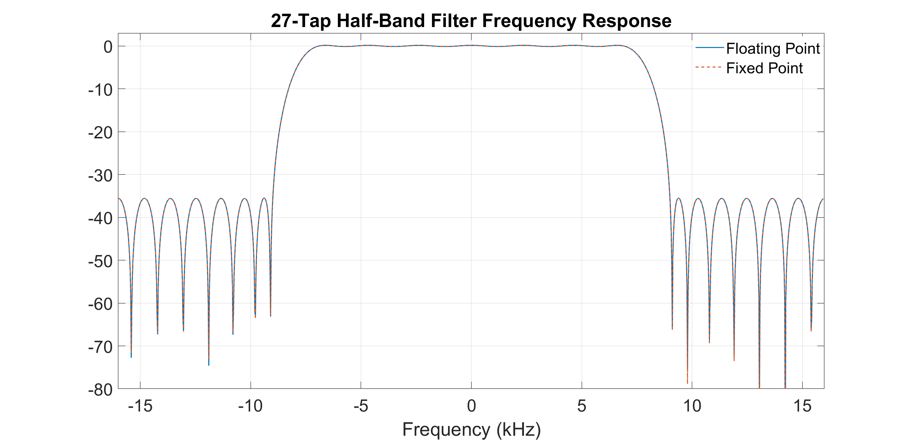

# Matlab Code

It is certainly possbile to write these functions in Python or C++, however I am most familiar with Matlab.  

# hb_design

`hb_design.m` designs a half-band filter using the Parks–McClellan algorithm in floating point which meets the design constraints. Every odd tap has magnitude zero, and the coefficients are symmetric, which reduces the number of multipliers required.  The program then converts the floating point to fixed point and plots the frequency response of both the floating point and fixed point models.  Q15 is more than enough bits to represent the coefficients so there is no loss shown when fixed point frequency response is overlaid with the floating point.  

This is not a particularly awesome filter in terms of frequency response, it is intended to be used as the 2nd and 3rd decimation filters for a Pulse Density Modulation (PDM) microphone to PCM converter, and that is all that is required for that application. You can modify the design constraints and generate a different filter response and evaluate it.

# hb_check and hb_check_tb

`hb_check.m` implements the half-band filter in Q15 Format in FIR Type I format using the same structure as the RTL.  `hb_check.m` uses [persistent](https://www.mathworks.com/help/matlab/ref/persistent.html) variables for the taps, and partial sums.  

`hb_check_tb.m` is a function that acts as a test bench for `hb_check.m`.  It generates a chirp waveform from user-defined sampling, starting frequency, and duration.  This function then repeatedly calls `hb_check.m` to perform the filtering, and plots the time domain and PSD of the input and output, and saves the input and output in Q15 as text files named `inputs.txt` and `outputs.txt`.  These text files can be loaded by the SystemVerilog testbench to compare the SV module with the Matlab code.  

## Usage:

`hb_check_tb(Fs, F0, T)` 
where 
* `Fs`= sampling frequency in Hz
* `F0`= starting frequency in Hz
* `T` = duration of chirp.

for example `hb_check_tb(32e3,100,1)`

